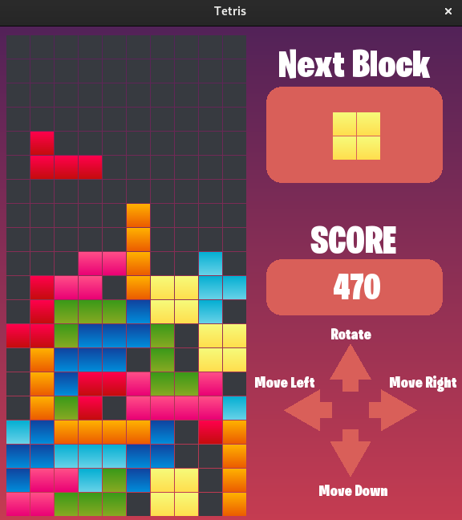

# 🎮🕹️ Tetris Clone in C++ 👾

## 📜 Description
A simple clone of popular game named Tetris using C++ programming language and SFML graphic library. This project was made to learn fundamentals of game development and GUI mechanics in C++.

## 📥 Installation
1. Clone the repository:
    ```sh
    git clone https://github.com/Kerciu/tetris-clone.git
    ```

2. Navigate to the project **build** directory:
    ```sh
    cd tetris-clone/build
    ```

3. Compile the project:
    ```sh
    make
    ```

4. Run the application:
    ```sh
    ./tetris
    ```

## 🛠️ How to play
1. **Start the game**: Execute the compiled application as described in the Installation section.
2. **Controls**:
    - **Up Arrow**: Rotate the Tetrimino.
    - **Left / Right Arrows**: Move the Tetrimino left or right.
    - **Down Arrow**: Speed up the fall of the Tetrimino.

3. **Objective**: The goal is to rotate and position the falling Tetriminoes to create and clear horizontal lines without gaps. As lines are cleared, the game progresses.

4. **Scoring**: Points are awarded for each line cleared and Tetrimino taken it's position after fall. The more lines cleared at once, the higher the score.

## 🖼️ Screenshot
<p align="center">
  
</p>

## 📝 Notes
Music used for the game: [Tetris Theme [NO COPYRIGHT]](https://www.youtube.com/watch?v=Q7mcjjl_P3k)
Sound effects used for the game: [Pixabay](https://pixabay.com/sound-effects/)

## 📜 License
This project is licensed under the MIT License. See the [LICENCE](LICENCE) file for details. 📝

## 📬 Contact
For questions, feedback, or support:
- **Author**: Kacper Górski
- **LinkedIn**: [Kacper Górski](https://www.linkedin.com/in/kacper-gorski)
- **Instagram**: [@kxcper.gorski](https://www.instagram.com/kxcper.gorski)
- **X**: [@Kerciuu](https://x.com/Kerciuu)
- **GitHub**: [Kerciu](https://github.com/Kerciu)
- **Support**: Email [kacper.gorski.contact@gmail.com](mailto:kacper.gorski.contact@gmail.com)

For issues, please open a GitHub Issue. 🚀

---
